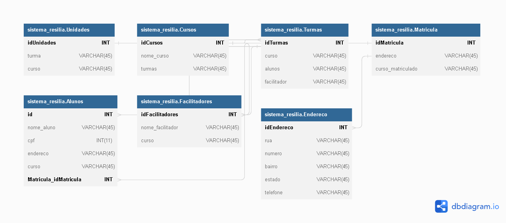

# PROJETO INDIVIDUAL Módulo 4 – Sistema Resilia
### Contexto
A Resilia está pensando em lançar um novo sistema de acompanhamento e para isso precisa de ajuda para modelar um banco de dados que vai armazenar seus cursos, turmas e alunos.

### O que é para fazer?
Para apoiar nesse sistema recebemos a tarefa de realizar essa modelagem e responder algumas perguntas com nosso modelo:

 - Existem outras entidades além dessas três?
 
 Foi adicionada a entidade Facilitadores e Endereco

- Quais são os principais campos e tipos?

 Os principais campos são os de ID

- Como essas entidades estão relacionadas?

 Utilizando chaves estrangeiras (FK).

Vamos tentar pensar em 2 registros para cada entidade para checar o preenchimento das informações no nosso modelo.

### O que devo entregar? 

A entrega deve ser realizada em um repositório do Github com um print do modelo proposto e um arquivo README respondendo as perguntas anteriores e apontando para os detalhes da modelagem proposta.

<a href="https://dbdiagram.io/d/63f7f8c0296d97641d835bfd">Acesse via DBDIAGRAM</a>
